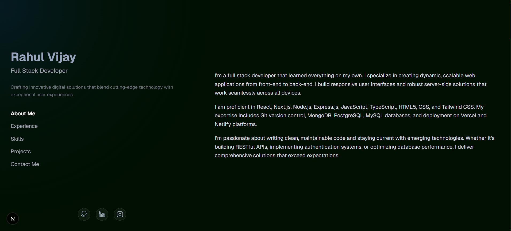

<div align="center">
  
# 🚀 Modern Portfolio Website

[](https://nextjs.org/)
[](https://reactjs.org/)
[](https://www.typescriptlang.org/)
[](https://tailwindcss.com/)
[](LICENSE)

**A stunning, modern portfolio website built with Next.js 16, featuring smooth animations, responsive design, and optimal performance.**

[Live Demo](https://rahulvijay.netlify.app/) • [Report Bug](https://github.com/rahulvijay81/portfolio/issues) • [Request Feature](https://github.com/rahulvijay81/portfolio/issues)



</div>

---

## ✨ Features

- 🎨 **Modern UI/UX** - Clean, professional design with smooth animations
- 🌙 **Smooth Scrolling** - Powered by Lenis for buttery-smooth navigation
- ⚡ **Lightning Fast** - Built with Next.js 16 and optimized for performance
- 📱 **Fully Responsive** - Perfect experience on all devices
- 🎭 **Framer Motion** - Beautiful animations and transitions
- 🎯 **SEO Optimized** - Built-in sitemap and robots.txt
- 🔒 **Type Safe** - Written in TypeScript for reliability
- 🎨 **Tailwind CSS** - Modern utility-first styling

## 🖼️ Screenshots

<div align="center">
  
</div>

## 🚀 Quick Start

### Prerequisites

- Node.js 18+ 
- npm, yarn, pnpm, or bun

### Installation

```bash
# Clone the repository
git clone https://github.com/rahulvijay81/portfolio.git

# Navigate to project directory
cd portfolio

# Install dependencies
npm install

# Run development server
npm run dev
```

Open [http://localhost:3000](http://localhost:3000) to see your portfolio! 🎉

## 📦 Tech Stack

| Technology | Purpose |
|------------|---------|
| **Next.js 16** | React framework with App Router |
| **React 19** | UI library |
| **TypeScript** | Type safety |
| **Tailwind CSS 4** | Styling |
| **Framer Motion** | Animations |
| **Lenis** | Smooth scrolling |
| **Lucide React** | Icons |

## 📁 Project Structure

```
portfolio/
├── src/
│   ├── app/              # Next.js app directory
│   ├── components/       # React components
│   ├── data/            # JSON data files
│   ├── lib/             # Utility libraries
│   ├── types/           # TypeScript types
│   └── utils/           # Helper functions
├── public/              # Static assets
└── ...config files
```

## 🛠️ Available Scripts

```bash
npm run dev      # Start development server with Turbopack
npm run build    # Build for production
npm run start    # Start production server
npm run lint     # Run ESLint
```

## 🎨 Customization

1. **Update Personal Info**: Edit files in `src/data/`
   - `about.json` - About section
   - `experience.json` - Work experience
   - `projects.json` - Your projects
   - `skills.json` - Technical skills
   - `social.json` - Social links

2. **Modify Styling**: Customize `tailwind.config.ts` and `src/app/globals.css`

3. **Add Components**: Create new components in `src/components/`

## 🚀 Deployment

### Deploy on Vercel (Recommended)

[](https://vercel.com/new/clone?repository-url=https://github.com/rahulvijay81/portfolio)

1. Push your code to GitHub
2. Import your repository on [Vercel](https://vercel.com)
3. Vercel will automatically detect Next.js and deploy

### Other Platforms

- **Netlify**: Connect your repo and deploy
- **AWS Amplify**: Use the Amplify Console
- **Docker**: Build and deploy using containers

## 📝 License

© 2024 All rights reserved.

## 🌟 Show Your Support

Give a ⭐️ if this project helped you!

## 🤝 Contributing

Contributions, issues, and feature requests are welcome!

1. Fork the Project
2. Create your Feature Branch (`git checkout -b feature/AmazingFeature`)
3. Commit your Changes (`git commit -m 'Add some AmazingFeature'`)
4. Push to the Branch (`git push origin feature/AmazingFeature`)
5. Open a Pull Request

## 📧 Contact

Rahul Vijay - [GitHub](https://github.com/rahulvijay81) • [LinkedIn](https://www.linkedin.com/in/rahulvijay81/)

Project Link: [https://github.com/rahulvijay81/portfolio](https://github.com/rahulvijay81/portfolio)

---

<div align="center">
  Made with ❤️ and ☕
  
  **[⬆ back to top](#-modern-portfolio-website)**
</div>
